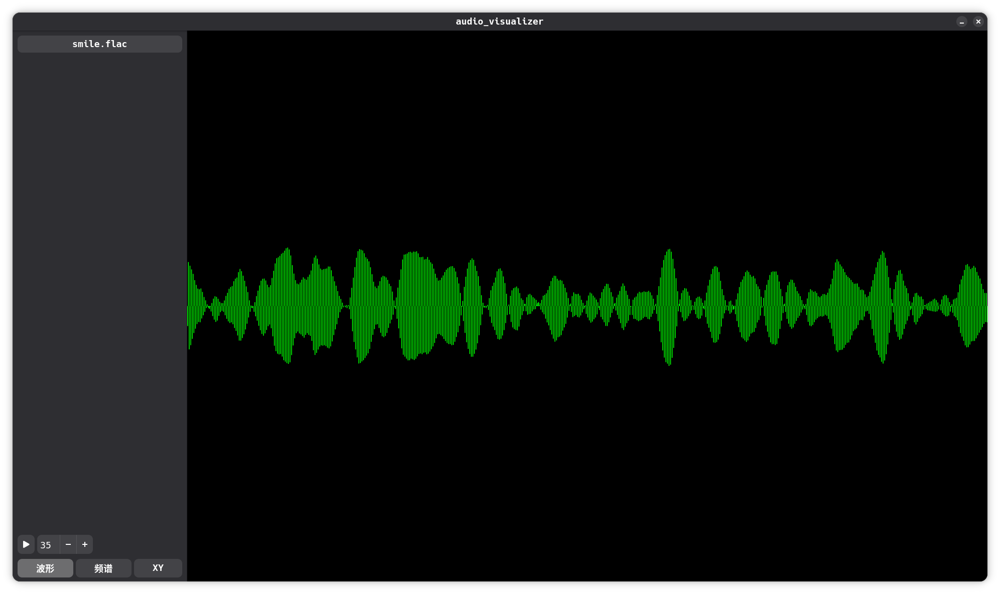
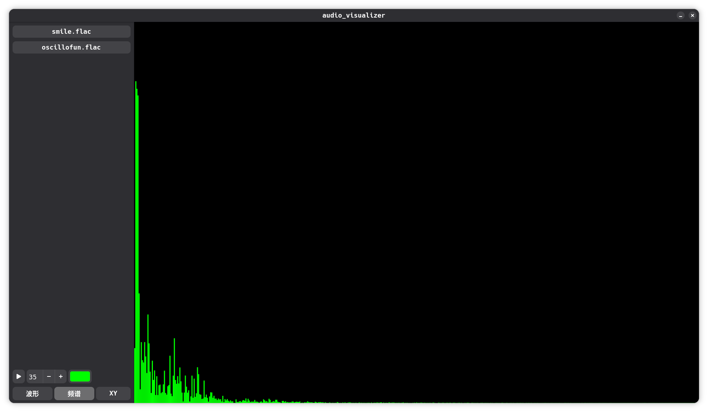
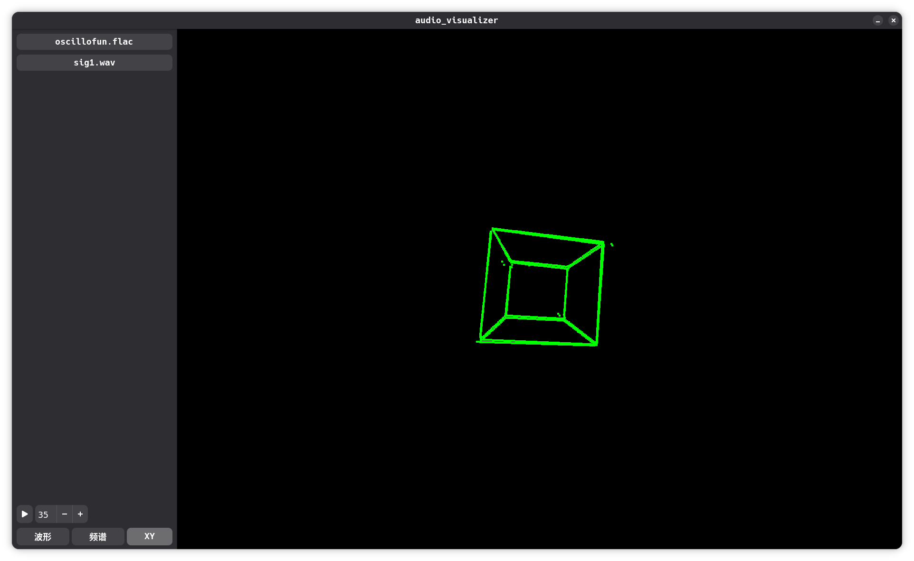

# Audio Visualizer
GTK4 实现的简单音频可视化工具

## 预览
| 波形| 频谱| 模拟示波器|
| --- | ----| ------|
|  |  |  |

## 支持的音频格式
[libsndfile: Supported formats](https://libsndfile.github.io/libsndfile/formats.html)

## 构建
依赖:
  * [GTK4](https://www.gtk.org/)
  * [Adw – 1](https://gnome.pages.gitlab.gnome.org/libadwaita/doc/main/index.html)
  * [PortAudio](https://www.portaudio.com/)
  * [Libsndfile](https://libsndfile.github.io/libsndfile/)
  * [FFTW](https://www.fftw.org/)

### Meson
``````sh
meson setup build
cd build
meson compile
``````
产物为``audio_visualizer``
